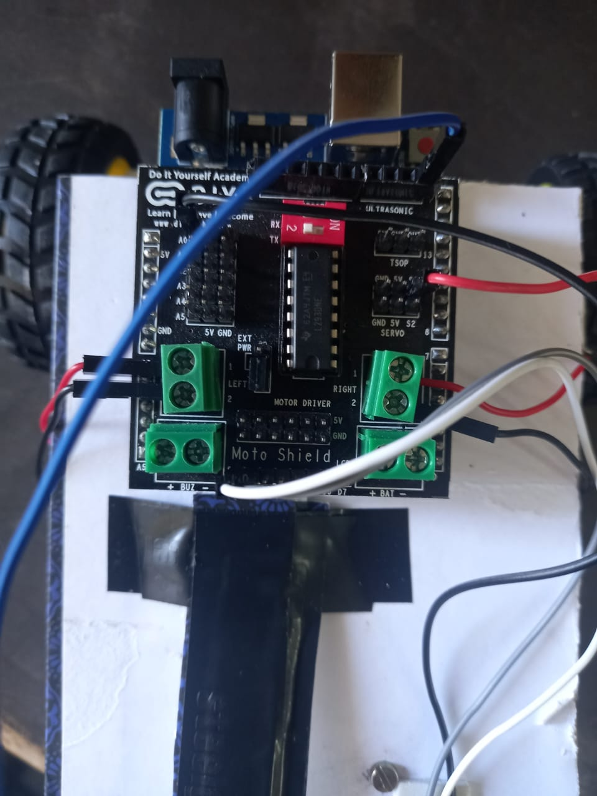

# 🔥 Fire Combat Robot

## Workshop Project (Certification)

## Project Description
This project was developed as part of a **workshop to obtain certification**. The **Fire Combat Robot** is designed to detect and control fire automatically without human intervention. The robot uses an **IR sensor** to detect fire in its surroundings and moves toward the detected fire source.

Once fire is detected, the robot activates a **fan-based extinguishing mechanism** to suppress the flames. The system is controlled using an **Arduino board**, which enables the robot to take decisions based on sensor inputs and execute appropriate actions.

This project demonstrates the basic working principles of **fire detection, autonomous movement, and embedded system control**, making it suitable as an introductory robotics and automation project.

---

## Aim
To design and build a fire combat robot that can automatically detect fire and extinguish it using a fan mechanism.

---

## Working Principle
1. The IR sensor continuously scans the front side of the robot.
2. If fire is detected, the robot moves toward the fire source.
3. The robot stops at a safe distance.
4. The fan is activated to extinguish the fire.
5. If no fire is detected, the robot continues searching.

---

## Components Used
- Arduino Board  
- IR Sensor (1)  
- BO Motors (2)  
- Wheels (2)  
- Castor Wheel (1)  
- DC Motor (Fan)  
- Small Fan  
- Motor Driver  
- Power Supply  
- Jumper Wires  

---

## Project Images

### Robot Setup

*(Images are for demonstration purposes.)*

---

## Learning Outcomes
- Basics of Robotics  
- Arduino Programming  
- Sensor Interfacing  
- Motor Control  
- Real-time Decision Making  

---

## Certification
This project was successfully completed as part of a **workshop program** and contributed toward obtaining the workshop certification.

---

##  Author
**Damini M.K**  
Workshop Project – Fire Combat Robot
